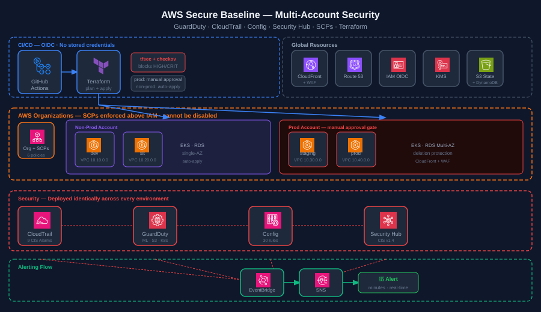
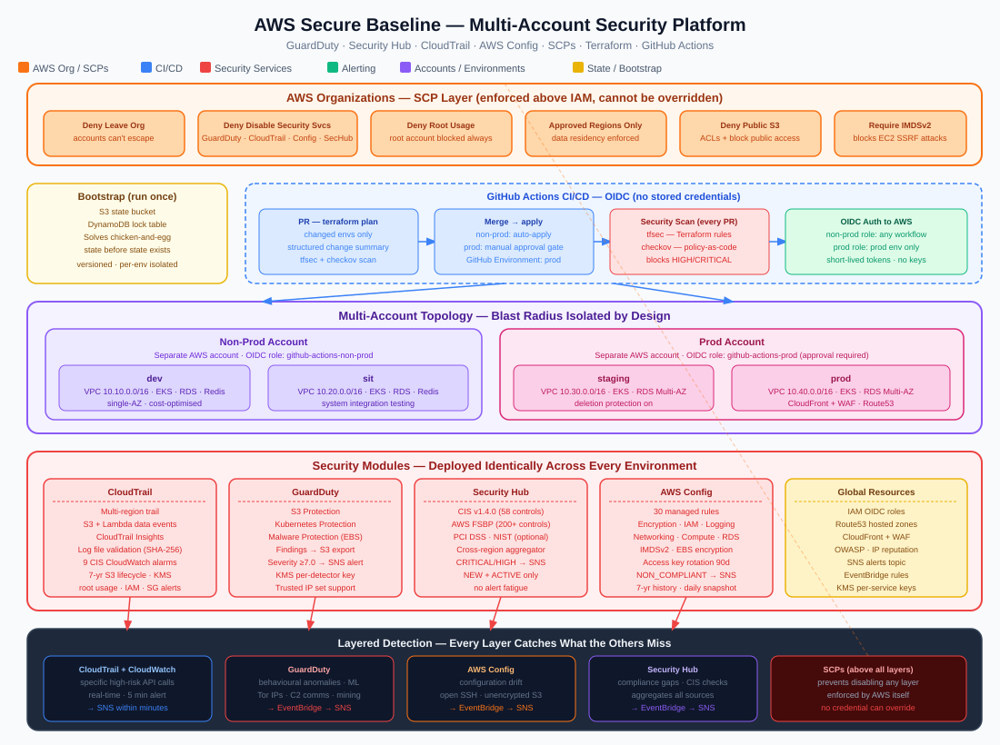

# terraform-aws

A production-grade AWS infrastructure template using pure Terraform, with Claude Code integration baked in. Fork this to get a multi-account, multi-environment AWS platform following the AWS Well-Architected Framework — with an AI pair programmer pre-configured for your IaC workflows.

## What's Included

| Layer | Services |
|---|---|
| Networking | VPC, subnets (private/public/intra), NAT Gateway, security groups |
| Compute | EKS (managed node groups), EC2 Auto Scaling, Lambda |
| Data | RDS PostgreSQL, ElastiCache Redis, SQS + DLQ, SNS, Secrets Manager |
| CDN & Edge | CloudFront, WAF (OWASP + IP reputation), Route53 |
| Observability | CloudWatch dashboards, metric alarms, log groups |
| Security | GuardDuty, Security Hub (CIS benchmark), AWS Config, OIDC IAM |
| CI/CD | GitHub Actions: plan on PR, apply on merge, security scan + pre-commit checks on every PR |
| AI | Claude Code agents, slash commands, hooks, rules, and skills |

## Account Topology

```
┌────────────────────────────┐   ┌────────────────────────────┐
│      Non-Prod Account      │   │       Prod Account          │
│                            │   │                            │
│  ┌────────┐  ┌─────────┐   │   │  ┌──────────┐  ┌──────┐   │
│  │  dev   │  │   sit   │   │   │  │ staging  │  │ prod │   │
│  │10.10/16│  │10.20/16 │   │   │  │ 10.30/16 │  │10.40/│   │
│  └────────┘  └─────────┘   │   │  └──────────┘  └──────┘   │
└────────────────────────────┘   └────────────────────────────┘
             │                                 │
             └───────────┬─────────────────────┘
                         │
              ┌──────────▼──────────┐
              │   Global Resources   │
              │  IAM (OIDC), Route53 │
              │  GuardDuty, SecHub   │
              └─────────────────────┘
```

## Architecture

### Overview



### Detailed Architecture



## Prerequisites

| Tool | Version | Install |
|---|---|---|
| Terraform | >= 1.6.0 | [developer.hashicorp.com/terraform/install](https://developer.hashicorp.com/terraform/install) |
| AWS CLI | >= 2.x | [aws.amazon.com/cli](https://aws.amazon.com/cli/) |
| tfsec | latest | `brew install tfsec` |
| checkov | latest | `pip install checkov` |
| infracost | latest | `brew install infracost` |
| terraform-docs | latest | `brew install terraform-docs` |
| Claude Code | latest | [claude.ai/code](https://claude.ai/code) |
| pre-commit | latest | `pip install pre-commit` |

## Developer Setup

Run these once after cloning. They install git hooks that run automatically on every `git commit`.

```bash
pip install pre-commit
pre-commit install
```

### What runs on every `git commit`

| Hook | What it does |
|---|---|
| `terraform_fmt` | Auto-formats all `.tf` files and re-stages them. If this triggers, re-run `git commit` — your files are already fixed. |
| `terraform_validate` | Runs `terraform init -backend=false` + `terraform validate` in each changed environment directory. Blocks commit on HCL errors. |
| `no-commit-to-branch` | Blocks direct commits to `main`. Use a feature branch and open a PR. |
| `check-merge-conflict` | Blocks commits containing unresolved merge conflict markers. |

### Running hooks manually

```bash
# Run all hooks against all files
pre-commit run --all-files

# Run a single hook
pre-commit run terraform_fmt --all-files
pre-commit run terraform_validate --all-files
```

### CI enforcement

The same hooks run in GitHub Actions on every PR (`.github/workflows/pre-commit.yml`). The `pre-commit` status check is **required** — PRs cannot merge to `main` until it passes. Direct pushes to `main` are blocked by branch protection rules.

---

## Getting Started

### 1. Fork and clone

```bash
gh repo fork <your-org>/terraform-aws --clone
cd terraform-aws
```

### 2. Bootstrap remote state (run once)

```bash
cd bootstrap
terraform init
terraform apply \
  -var="state_bucket_name=<your-unique-bucket-name>" \
  -var="project=<your-project>" \
  -var="owner=<your-team>"
```

### 3. Wire up all backend configs

```bash
BUCKET=$(terraform output -raw state_bucket_name)
find .. -name "backend.tf" -exec sed -i "s/REPLACE_WITH_STATE_BUCKET_NAME/$BUCKET/g" {} \;
```

### 4. Set GitHub Actions secrets

Go to **Settings → Secrets → Actions** in your GitHub repo:

| Secret | Value |
|---|---|
| `NON_PROD_ROLE_ARN` | Output from `global/iam`: `github_actions_non_prod_role_arn` |
| `PROD_ROLE_ARN` | Output from `global/iam`: `github_actions_prod_role_arn` |

Create a GitHub Environment named **`prod`** with required reviewers for the prod apply gate.

### 5. Initialize environments

```bash
for env in accounts/non-prod/dev accounts/non-prod/sit accounts/prod/staging accounts/prod/prod; do
  terraform -chdir=$env init
done
```

### 6. Deploy dev first

```bash
cd accounts/non-prod/dev
terraform plan -var-file=terraform.tfvars
terraform apply -var-file=terraform.tfvars
```

## Using Claude Code

### Agents

Activate an agent to switch Claude's behavior for a specific task:

| Agent | When to use |
|---|---|
| `terraform-planner` | Planning infrastructure changes — asks about blast radius, dependencies, rollback |
| `security-auditor` | CIS benchmark review before merging |
| `cost-estimator` | Estimating monthly AWS spend before apply |
| `code-reviewer` | HCL quality, naming, tagging compliance |
| `incident-responder` | Incident triage and surgical Terraform remediation |

### Slash Commands

| Command | Description |
|---|---|
| `/plan <env>` | `terraform plan` with structured change summary |
| `/apply <env>` | Safety-gated `terraform apply` (confirmation required for staging/prod) |
| `/security-scan [path]` | tfsec + checkov, grouped by severity |
| `/cost-estimate <env>` | infracost monthly breakdown |
| `/drift-check <env>` | Detect infrastructure drift from state |
| `/new-module <name>` | Scaffold a new module stub |
| `/docs [path]` | Generate terraform-docs |

### Hooks

- **Pre-edit:** `terraform fmt -check` runs before any `.tf` file edit in `accounts/`
- **Post-edit:** `terraform fmt` auto-fixes formatting after every `.tf` edit

### Rules (always-on)

Loaded into every Claude session in this project:
- `terraform.md` — HCL style, version pinning, file organization
- `security.md` — encryption, network security, IAM requirements
- `naming.md` — `{project}-{env}-{service}-{descriptor}` pattern
- `tagging.md` — 5 required tags via `default_tags`
- `state.md` — state hygiene, `moved` blocks, import workflow

## Customizing for Your Project

1. Replace `myapp` with your project name in all `terraform.tfvars` files
2. Update `root_domain` in `global/route53/terraform.tfvars`
3. Replace `<YOUR_ORG>` in `main.tf` git module sources with your GitHub org
4. Update `acm_certificate_arn` in each `terraform.tfvars` after creating ACM certificates

## Module Sources

**Terraform Registry** (pinned versions):
- [terraform-aws-modules/vpc](https://registry.terraform.io/modules/terraform-aws-modules/vpc/aws)
- [terraform-aws-modules/eks](https://registry.terraform.io/modules/terraform-aws-modules/eks/aws)
- [terraform-aws-modules/rds](https://registry.terraform.io/modules/terraform-aws-modules/rds/aws)
- [terraform-aws-modules/lambda](https://registry.terraform.io/modules/terraform-aws-modules/lambda/aws)
- [terraform-aws-modules/cloudfront](https://registry.terraform.io/modules/terraform-aws-modules/cloudfront/aws)

**Git source** (create these repos in your org, replace `<YOUR_ORG>`):
- `terraform-aws-observability` — CloudWatch dashboards and alarms
- `terraform-aws-security-baseline` — GuardDuty, Security Hub, Config
- `terraform-aws-iam-baseline` — IAM hardening patterns

## Security Posture

- All data encrypted at rest (SSE-KMS) and in transit
- No public S3 buckets — public access block enforced everywhere
- No SSH/RDP open to the internet
- EKS cluster endpoint private
- GuardDuty + Security Hub (CIS benchmark) enabled globally
- GitHub Actions authenticates via OIDC (keyless — no long-lived access keys)
- tfsec + checkov run on every PR, fail on HIGH/CRITICAL findings